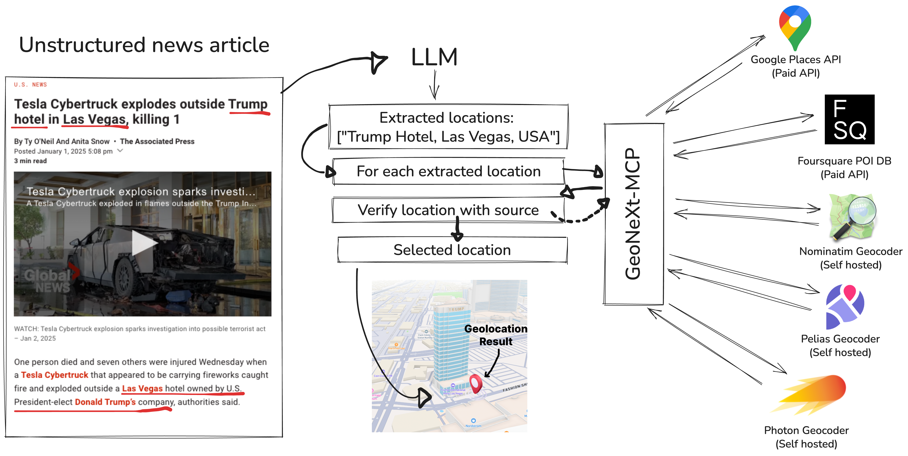

# GeoNeXt

<p align="center">
  
</p>

<div align="center">

[](#)
[](#)
[](#)

</div>

> **GeoNeXt** is a state‑of‑the‑art, LLM‑powered geoparsing framework that extracts locations from unstructured text and resolves each to precise coordinates—often down to street-level accuracy.

GeoNeXt ships in two parts:

| Repo | Purpose |
|------|---------|
| [`GeoNeXt`](https://github.com/haharooted/GeoNeXt) | Core LLM‑driven geoparser |
| [`GeoNeXt‑MCP`](https://github.com/haharooted/GeoNeXt-MCP) | Plug‑&‑play **MCP** (Model Context Protocol) server that exposes GeoNeXt as an API/tool for any LLM supporting MCP tool use |

---

## Table&nbsp;of&nbsp;Contents
1. [Key Features](#key-features)  
2. [Why GeoNeXt?](#why-geonext)  
3. [Quick Start](#quick-start)  
4. [Datasets](#datasets)  
5. [Approaches & Related Work](#approaches--related-work)  
6. [Evaluation Metrics](#evaluation-metrics)  
7. [Architecture](#architecture)  
8. [Citation](#citation)  
9. [Contributing](#contributing)  
10. [License](#license)  

---

## Key Features
- **Multi‑LLM support** – works with OSS models (e.g.&nbsp;Mistral 7B) *and* proprietary giants (OpenAI o3‑pro).  
- **Multiple toponyms per post**
- **Street‑level geocoding** via smart tool‑use + geocoding fusion.  
- **Plug‑and‑play MCP server** (`GeoNeXt‑MCP`) for effortless tool‑calling.  
- Ships with a **brand‑new evaluation dataset** (Multilingual *UA‑RU* ).  

## Why GeoNeXt?
Traditional pipelines treat toponym recognition and resolution as separate stages. GeoNeXt leverages recent reasoning‑capable LLMs to *jointly* understand context, disambiguate place names and call geocoding tools when needed, surpassing classic rule‑based and NER based geolocation.

## Quick Start
```bash
# Clone
git clone https://github.com/haharooted/GeoNeXt.git
cd GeoNeXt

# Create env
python -m venv .venv && source .venv/bin/activate
pip install -r requirements.txt

cp .env.example .env # then add openai keys and MCP url here

# Run app
python cli.py 
```

### Using the MCP server
```bash
# Setup a fresh Ubuntu 24 server (i suggest Hetzner.com) with atleast 4GB RAM, then run:
wget https://raw.githubusercontent.com/haharooted/GeoNeXt-MCP/refs/heads/main/deploy.sh && bash deploy.sh
```
For debugging:
```bash
bash ./debugger/start-debugger.sh
```

Once running, any agent‑enabled LLM can invoke the **geocode** tool exposed by GeoNeXt‑MCP.

## Datasets
| Category | Corpus | Scope |
|----------|--------|-------|
| **News** | LGL‑19 · GeoWebNews · TR‑News · TopRes19th · HIPE‑2020 | Local, global, historic |
| **Wikipedia** | WikToR | 5 k ambiguous articles |
| **Social Media** | GeoCorpora | 6 648 tweets (2014‑2015) |
| **Crisis** | **NEW:** GeoNeXt‑DKPol · GeoNeXt‑UA‑RU | Homeland & foreign crisis mgmt |

Full details in the [paper](#citation).

## Approaches & Related Work
<details>
  <summary>Click to expand</summary>

**Rule‑based / Classical**  
- Edinburgh Geoparser (2010)  
- Mordecai (2017)  
- CamCoder (2018)  
- ...

**Transformer / Entity‑linking**  
- BLINK · GENRE · ReFinED · SAPBERT · DeezyMatch · GeoNorm · T‑Res · LUKE · Voting (DBSCAN)

See the *Related Work* section of the paper for citations.

</details>

## Evaluation Metrics
- **Accuracy@161 km** (standard) & **Accuracy@500 m** (GeoNeXt zoom‑in)  
- **Mean / Median Error Distance**  
- **AUC of log‑binned error curve**  
- **Coverage**  

> 👉 *All six metrics are reported per‑dataset for a holistic view.*

## Architecture
<p align="center">
  
</p>

## Citation
If you use GeoNeXt in academic work, please cite:

```bibtex
@misc{nielsen2025geonext,
  title   = {GeoNeXt: Achieving Beyond State‑of‑the‑Art Performance in Geolocating Unstructured Text},
  author  = {ASD},
  year    = {2025},
  howpublished = {\url{https://github.com/haharooted/GeoNeXt}},
}
```

## Contributing
Pull requests are welcome!  Please open an issue first to discuss major changes.  
Make sure to run `pre‑commit` hooks and unit tests (`pytest`) before submitting.

## License
GeoNeXt is released under the **MIT License**. See [`LICENSE`](LICENSE) for details.
